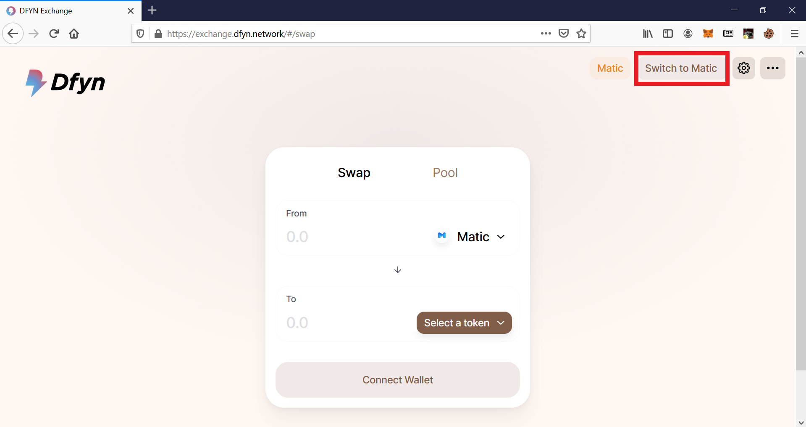

# Adding liquidity to Dfyn AMM from Ethereum network

Since Dfyn AMM works on top of Matic (now Polygon) network, adding liquidity to Dfyn AMM from Ethereum network requires you to complete a few steps. Take a look at this guide to learn how to add liquidity to Dfyn AMM from your Ethereum wallet.&#x20;

## Transferring funds from Ethereum network to Matic network

**Step 1:** Go to [https://wallet.matic.network/](https://wallet.matic.network/) and click on "Move funds on Matic Mainnet."

The following screen should open up which will have an interface to transfer funds from Ethereum to Matic.

**Step 2:** Click on the dropdown to select the asset to transfer.


Ensure that your MetaMask is connected to the Ethereum network.&#x20;


**Step 3:** After clicking on the dropdown, search for the asset you want to transfer. In this guide we will be transferring ETH from Ethereum to Matic.

.png>)

**Step 4:** Enter the amount of funds you want to transfer and click on Transfer.

.png>)


Note that the transfer mode should say PoS Bridge instead of Plasma.


**Step 5:** The following screen with some important notes will open up. After reading these notes, click on Continue.

.png>)

**Step 6:** A screen showing the estimated gas costs will open up. Click on continue.


The cost shown on this screen is just an estimate. The actual gas costs may vary. It is a good practice to have a little more than the estimated gas cost in your wallet.


**Step 7:** Review the transaction and click on Continue.

.png>)

Upon clicking on Continue, the process initiates the interaction with MetaMask.

**Step 8:** A MetaMask popup will open up showing the actual gas costs. Review the total amount (gas + transfer value) before clicking on confirm.

.png>)


You will have to bear the gas fees on Ethereum when doing this transfer. MetaMask will show both — the Gas fees as well as the total transfer including the gas fees.


**Step 9:** Confirm this transaction and wait for the $ETH to be transferred to the Matic Mainnet.

.png>)

Now that we have loaded the funds to the Matic Network, we can now add liquidity to Dfyn AMM.&#x20;


You can exit funds from Matic to Ethereum in a similar way. On the Matic wallet page, choose the asset you want to exit to Ethereum and click on Withdraw. It will open up the same bridge, but this time the bridge will point from Matic to Ethereum.&#x20;


## **Configuring MetaMask to work with Matic Mainnet** 

**Step 1:** When you go to [exchange.dfyn.network](https://exchange.dfyn.network), click on the option to "Switch to Matic" on the top right.&#x20;

**Step 2:** If you don't already have the Matic Mainnet configured on MetaMask, Dfyn will add the Matic network configuration to MetaMask for you. The following dialog should open up.

.png>)

Click on "Approve" to allow Dfyn to add Matic network to your MetaMask wallet.


This step is required only if you don't already have Matic network set up on MetaMask.


**Step 3:** Next, allow Dfyn to switch the network to Matic.

.png>)

## Adding Liquidity to Dfyn AMM 

**Step 1:** Head to [https://exchange.dfyn.network/](https://exchange.dfyn.network/) and add liquidity for your desired pair. In this guide, we are adding liquidity for Matic and USDT.

**Step 2:** Now Approve transaction for spending USDT/other crypto. Once that is done, the Supply button will be enabled. Then click on Supply and will you have to sign transactions on MetaMask as usual.

After you add liquidity it will show your added liquidity and share of the pool.
