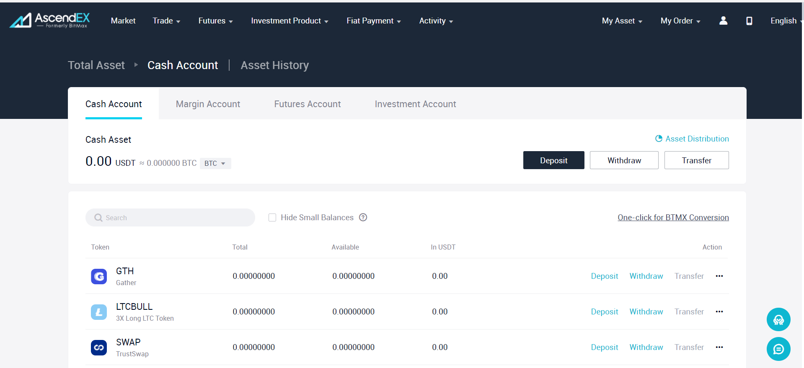
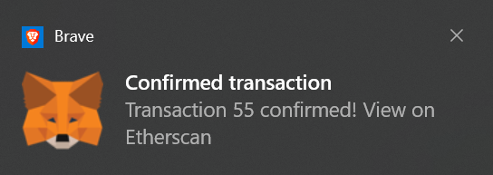
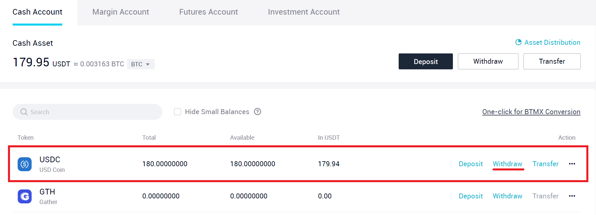
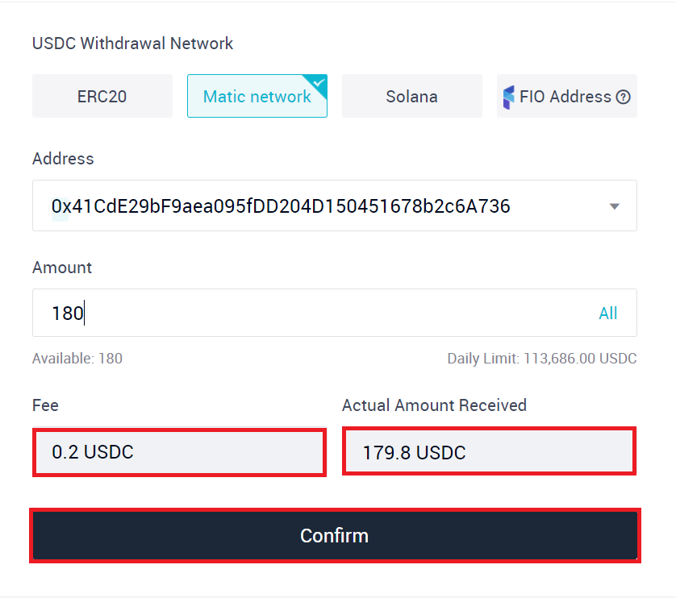
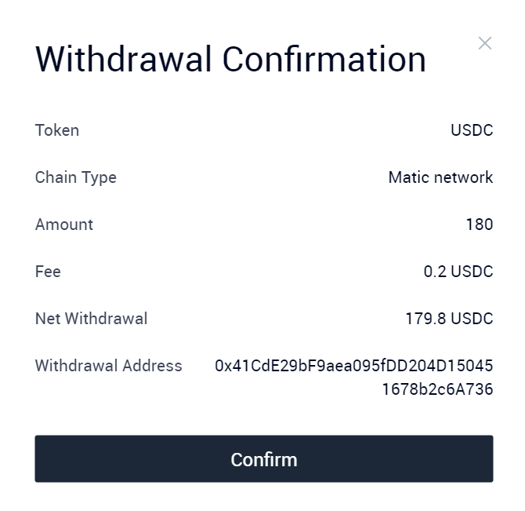
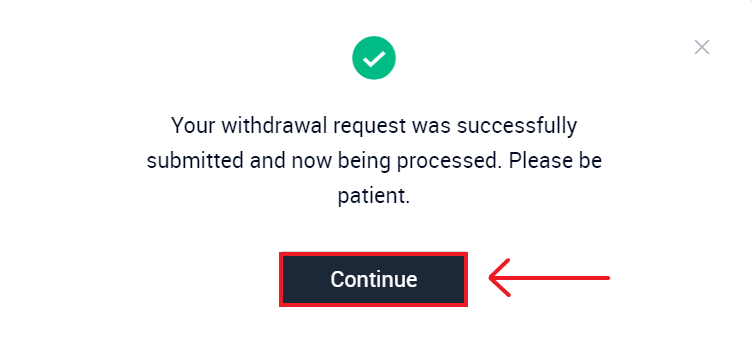
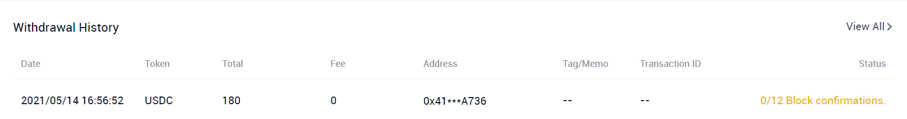
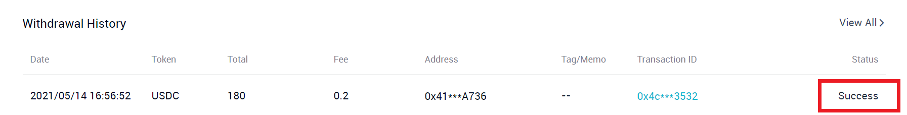

# Bringing funds from Ethereum to Matic using AscendEX (BitMax)

As discussed [here](using-ascendex-bitmax-to-exit-funds-from-matic-to-ethereum.md), AscendEX is a much cheaper and faster alternative to Matic PoS bridge for transferring funds in and out of Matic. Since we have already covered the steps to exit funds from Matic in the previous guide, in this guide we will be focusing on the steps involved in transferring assets from Ethereum to Matic through AscendEX.&#x20;

We will be covering this guide by showing the transfer of USDC tokens.

### **Depositing USDC from Ethereum to AscendEX**

**Step 1)** Go to [https://ascendex.com/](https://ascendex.com/).

**Step 2)** Sign up on the website if you don't already have an account. If you do, simply login using your credentials.

**Step 3)** After logging in, you should be redirected to AscendEX home page. On the top right hand side, you should see a dropdown that says **My Asset**. Hover over that option and then select **Cash Account**.

.png>)

You should see the following screen after clicking on **Cash Account**.

**Step 4)** In the search box, type in USDC. In your search results, click on **Deposit** button corresponding to the USDC token.

.png>)


Note: If you skipped mobile verification during the sign up process, you would be required to complete it before doing any transactions on AscendEX.


**Step 5)** In the screen that appears following the previous step, copy the USDC Deposit address for ERC20 Network.&#x20;

.png>)

**Step 6)** Now open your MetaMask wallet (or the wallet where you hold your funds) and make sure that you are on the Ethereum Mainnet. Click on the **Send** button to enter the deposit address.&#x20;

.png>)

**Step 7)** Paste the Deposit Address that you copied from AscendEX.

.png>)

**Step 8)** After pasting your address, MetaMask will load the following screen.

.png>)

Click on the asset dropdown to see the list of all your tokens.

**Step 9)** Select **USDC** from the dropdown.

.png>)

**Step 10)** Enter the amount of USDC tokens you want to deposit and click on **Next**.

.png>)

**Step 11)** Review the MetaMask transaction and click on **Confirm**. Upon the confirmation of your transaction, you will receive a notification from MetaMask.

After a few minutes, your USDC tokens should reflect in your cash asset balance on AscendEX.


Note that AscendEX requires multiple block confirmations before reflecting your balance. There might be a delay between transaction confirmation on Ethereum and the actual time when your USDC tokens get deposited on AscendEX.


### **Withdrawing Route from AscendEX**

**Step 1)** On the **Cash Account** page, search for USDC (if it is the only token you hold on AscendEX, then it should appear on the top) and click on **Withdraw** corresponding to the USDC token.&#x20;

**Step 2)** In the withdraw window, switch to Matic network.

.png>)

**Step 3)** Enter your Matic address where you want to send your tokens as well as the amount to be transferred. Review the **Fee** and the **Actual Amount Received** and click on **Confirm.**


Keep in mind that AscendEX has minimum withdrawal limits that can change. You won't be able to withdraw funds if you have deposited less than the minimum withdraw limit. For example, at the time of making this guide the minimum withdrawal amount for USDC was 140 USDC.


**Step 4)** AscendEX will generate a prompt asking you to confirm your transaction. Review the transaction details and click on **Confirm**.

**Step 5)** After confirming the transaction, AscendEX will ask you to verify yourself by entering two 6-digit codes. Click on **Send Code** in both the boxes. **** One code will be received on the registered email address and one will be received on the registered phone number.

**Step 6)** After verifying yourself, your withdrawal request would be successfully accepted.&#x20;

Clicking on **Continue** will take you to your withdrawal history where you can monitor your transaction.&#x20;

After a while, the transaction should succeed and you can check your Matic wallet for the credited funds.

