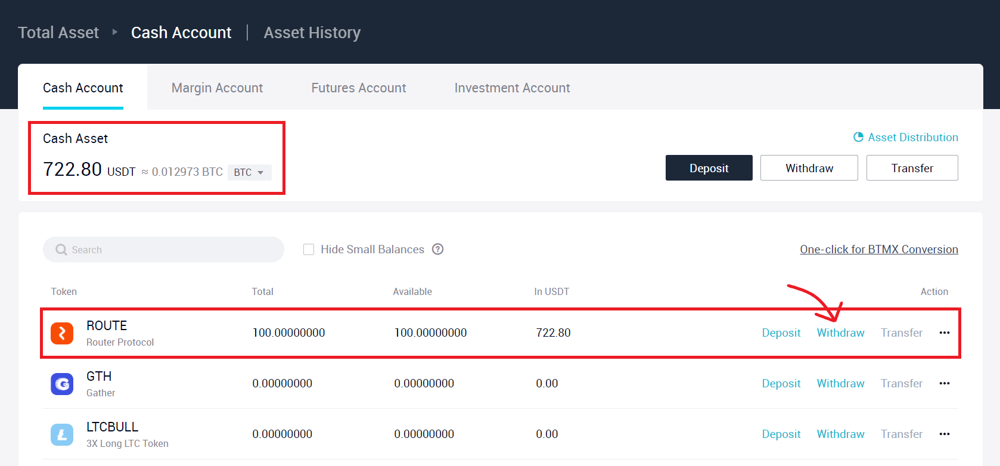
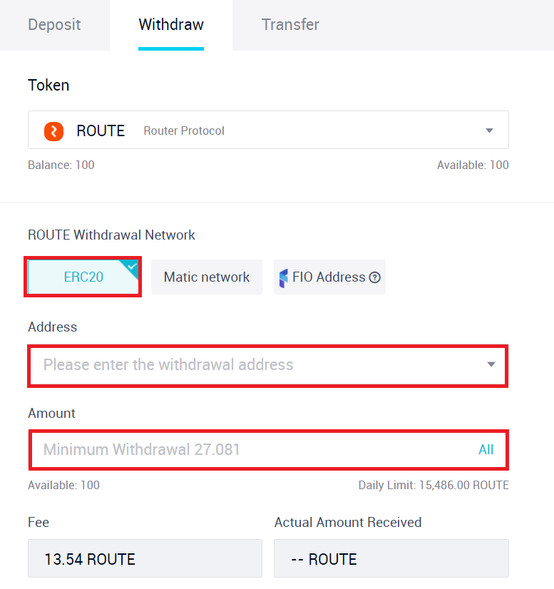
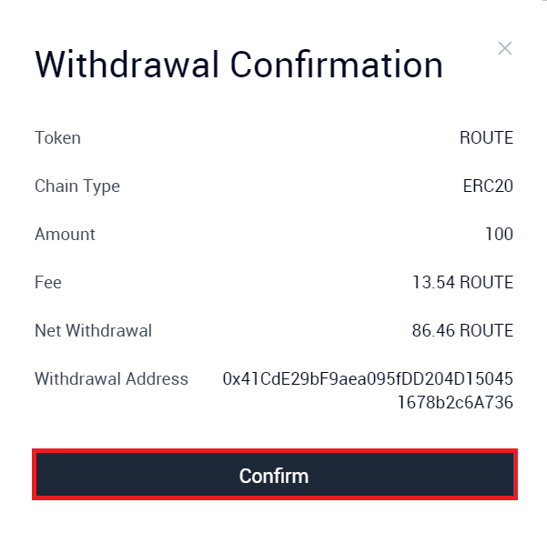
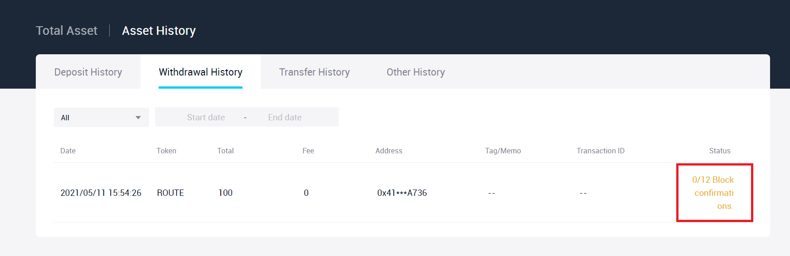
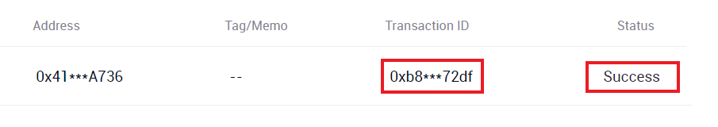

# Using AscendEX (BitMax) to exit funds from Matic into Ethereum

Since the Matic PoS bridge can get really expensive in terms of gas costs, in this guide, we want to introduce a more cost effective way of transferring funds from Matic to Ethereum. This approach can also be used to transfer funds from Ethereum to Matic (the guide for which is available [here](bringing-funds-from-ethereum-to-matic-using-ascendex-bitmax.md)).

Using AscendEX, you can exit liquidity from Matic to Ethereum in three tokens:

* Matic
* ROUTE
* USDC

AscendEX currently supports only these three tokens on the Matic network. If you want to exit some other asset from Matic, you can:

1. transfer your funds using the [Matic PoS bridge](https://wallet.matic.network/bridge).
2. use the [Dfyn exchange](https://exchange.dfyn.network/) to swap your asset for either Matic/ROUTE/USDC at zero gas costs and then follow the guide given below to transfer your funds to AscendEX and then to Ethereum. To get the desired asset in the Ethereum wallet, you can do one of the following: (a) You can use AscendEX itself to convert your Matic/ROUTE/USDC tokens to the desired asset before transferring funds from AscendEX to Ethereum or (b) you can transfer ROUTE/USDC/Matic tokens to your Ethereum wallet and then use [Uniswap](https://app.uniswap.org/) or any other DEX on Ethereum to swap those tokens for your desired asset. Swapping assets on AscendEX require minimal fees and zero gas costs and therefore result in much cheaper conversions.

Of the aforementioned approaches, the Matic PoS bridge might seem like the more simpler one of the two. However, using the Dfyn + AscendEX route results in much cheaper and faster transfers.

| AscendEX                                                                       | Matic PoS Bridge                             |
| ------------------------------------------------------------------------------ | -------------------------------------------- |
| Zero deposit fees + Low withdrawal fees (anywhere between $25 - $50)           | High Gas Costs (anywhere between $80 - $160) |
| Takes a matter of minutes to transfer funds from Matic to ETH through AscendEX | Takes about 3-4 hours to transfer funds      |

In this guide, we will show you how to transfer ROUTE tokens from Matic to Ethereum.

### **Depositing Route to AscendEX**

**Step 1)** Go to [https://ascendex.com/](https://ascendex.com/).

**Step 2)** Sign up on the website if you don't already have an account. If you do, simply login using your credentials.

**Step 3)** After logging in, you should be redirected to AscendEX home page. On the top right hand side, you should see a dropdown that says **My Asset**. Hover over that option and then select **Cash Account**.

.png>)

You should see the following screen after clicking on **Cash Account**.

.png>)

**Step 4)** In the search box, type in ROUTE or Router. In your search results, click on **Deposit** button corresponding to the ROUTE token.

.png>)


Note: If you skipped mobile verification during the sign up process, you would be required to complete it before doing any transactions on AscendEX.


**Step 5)** Following the previous step, you should encounter the following screen:

.png>)

Even though the ERC20 address and Matic network address that AscendEX provides for ROUTE token is same, make sure you click on the **Matic network** before copying the Deposit Address.

**Step 6)** Now open your MetaMask wallet (or the wallet where you hold your funds) and make sure that you are on the Matic Mainnet. Click on the **Send** button to enter the deposit address.&#x20;

.png>)

**Step 7)** Paste the Deposit Address that you copied from AscendEX.


Make sure you copy the Matic address of only the token that you intend to transfer. In this case, we have copied the ROUTE address since we want to deposit ROUTE tokens on AscendEX.


**Step 8)** After pasting your address, MetaMask will load the following screen.

.png>)

Click on the asset dropdown to see the list of all your tokens.

**Step 9)** Select **ROUTE (PoS)** token from the dropdown.

.png>)

**Step 10)** Enter the amount of ROUTE tokens you want to deposit and click on **Next**.

**Step 11)** Review the transaction and click on **Confirm**.

.png>)

Upon the confirmation of your transaction, you will receive a notification from MetaMask.

.png>)

After a few minutes, your ROUTE tokens should reflect in your cash asset balance on AscendEX.


Note that AscendEX requires multiple block confirmations before reflecting your balance. There might be a delay between transaction confirmation on Matic and the actual time when your ROUTE tokens get deposited on AscendEX.


### **Withdrawing Route from AscendEX**

**Step 1)** On the **Cash Account** page, search for ROUTE (if it is the only token you have on AscendEX, then it should appear on the top) and click on **Withdraw** corresponding to the ROUTE token.&#x20;


In case you don't want to withdraw ROUTE tokens to Ethereum, you can trade ROUTE for multiple other assets on AscendEX and then withdraw those assets from AscendEX to Ethereum.


**Step 2)** In the withdraw window, enter your ERC20 (Ethereum) address where you want to send your tokens as well as the amount to be transferred. ****&#x20;


Keep in mind that AscendEX has minimum withdrawal limits.&#x20;



Some fee is always associated with AscendEX withdrawal transactions. This fee is higher when withdrawing to Ethereum as compared to when withdrawing to Matic. For example, the fee for withdrawing ROUTE to Ethereum was around 13.54 ROUTE at the time of writing this guide. In contrast, the withdrawal fee for Matic network was 0.1 ROUTE.


**Step 3)** After entering your ERC20 address and the amount to withdraw, review the **Fee** and the **Actual Amount Received** and click on **Confirm.**

.png>)

**Step 4)** AscendEX will generate a prompt asking you to confirm your transaction. Review the transaction details and click on **Confirm**.

**Step 5)** After confirming the transaction, AscendEX will ask you to verify yourself by entering two 6-digit codes. Click on **Send Code** in both the boxes. **** One code will be received on the registered email address and one will be received on the registered phone number.

.png>)

**Step 6)** After verifying yourself, your withdrawal request would be successfully accepted.&#x20;

.png>)

Clicking on **Continue** will take you to your withdrawal history where you can monitor your transaction.

After a while, the transaction should succeed and you can check your Ethereum wallet for the credited funds.

