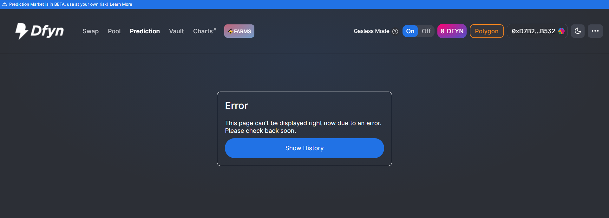

# Prediction Markets FAQs

### What is Dfyn's Prediction Markets contract address?

Verified contract can be found here: [https://polygonscan.com/address/0x150B4fD25c7c0c65301e86B599822f2feeCC29E7](https://polygonscan.com/address/0x150B4fD25c7c0c65301e86B599822f2feeCC29E7#code)

### How is the price of an asset determined?

To monitor MATIC’s live price feed, Dfyn will use the MATIC oracle provided by ChainLink. We decided to go with ChainLink’s oracle since it is fully decentralized, provides reliable data and has a robust security mechanism. Furthermore, the ChainLink team has agreed to accommodate our request for a faster price feed by providing a custom feed that allows Dfyn to query the most recent MATIC price every 5 seconds.

### **Can I change or remove my position after entering?**

No, once you enter a position, you can not make any changes to it since the funds are locked in the contract.

### Are there any fees?

Yes, 3% of each round’s total pool will be credited to the Dfyn treasury. This fee will later be used to buy back DFYN.

_**Note: The fee percentage is subject to change.**_

### How is the payout calculated?

For each round, the payout is calculated using the following formulas:

* Payout Ratio for the BULL Pool = Prize Pool ÷ TVL in the BULL Pool
* Payout Ratio for the BEAR Pool = Prize Pool ÷ TVL in the BEAR Pool

For example, if 1500 MATIC is locked in the BEAR pool, and the overall prize pool is 4500 MATIC, the BEAR payout ratio will be (4500÷1500)=3x, and the BULL payout ratio will be (4500÷3000)=1.5x. The following formula gives the payout received by each winner:

* Payout Amount = Payout Ratio × Value Locked× (1 — Treasury Fee)

In the above case, if you entered a BEAR position with 200 MATIC, and the round ends in a BEAR result, you would get a payout of (3\*200) × (1–0.03) = 582 MATIC (assuming a fee of 3%). Your profit would be 352 MATIC (582–200).

### **What happens if no one enters an opposing position?**

In such an event if the round ends with the position that the users entered, their locked funds are returned to them (minus the fee). However, if the round ends with the opposite position, the funds will be credited to the treasury.&#x20;

### **What happens if the closed price in a round is equal to the locked price?**

In such an unlikely event, no one will be regarded as the winner, and all the locked funds will be transferred to the treasury.

### I am getting this error "This page can't be displayed due to an error. Please check back soon." How to resolve this?

This error occurs when there are some syncing issues with Dfyn's Graph node. If you get this error, there is no need to worry. It will get resolved on its own within a few minutes.

### What happens if a round is cancelled?

A round may sometimes be cancelled due to some technical issues. If you had entered any funds in a round which is later cancelled, they will be returned to you without the deduction of any fees.

### Is there a time limit before I can collect my winnings?

No, you can collect your winnings at any time. You can check out how to collect your winnings [here](how-to-participate-in-prediction-markets.md#claiming-unclaimed-winnings).
