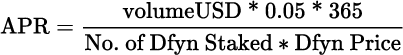

# vDfyn Vault FAQs

### What is the ROI for staking Dfyn in the vDfyn vault? 

It’s important to note that the APR in the vDfyn vault changes continuously due to fluctuating trading volume on Dfyn exchange and the number of DFYN tokens staked in the vault. Therefore, it is difficult for us to present future predictions on its development. However, for those who want to know how to calculate the APR at a given moment in time, here’s the formula:


Prediction market fees will also be directed to the vDfyn vault in the future.


### How frequently is the fees directed into the vDfyn vault? 

The vDfyn maker contract converts fees to DFYN tokens and directs them as dividends to the vDfyn vault every 8 minutes.

### Do I need to stake vDfyn tokens somewhere to accrue the dividends? 

No, you don’t need to stake your vDfyn tokens anywhere. It will automatically accrue the dividends.

### Can I enter and exit the vDfyn vault at any time? 

Yes, your staked Dfyn are not time-locked, so you can claim them whenever you want.

### Can the Dfyn/vDfyn ratio go down? 

No, the Dfyn/vDfyn ratio can only go up. The Dfyn/vDfyn ratio is not affected when more Dfyn tokens are staked. The ratio will increase only when more rewards are directed to the vault since no vDfyn tokens are minted against the rewards that are added in the vault. This essentially means that users will always be able to claim more than or equal to the number of Dfyn tokens that they staked.

### Is the contract code verified? 

Yes, the contract code is verified and can be found [here](https://polygonscan.com/address/0x75455c3de45dd32cbe9a5ad5e518d3d50823c976).

### What is the contract address? 

[0x75455c3de45dd32cbe9a5ad5e518d3d50823c976](https://polygonscan.com/address/0x75455c3de45dd32cbe9a5ad5e518d3d50823c976)
